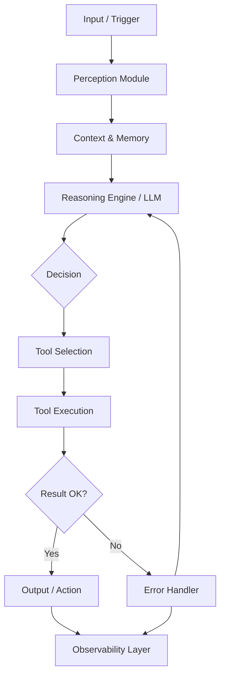
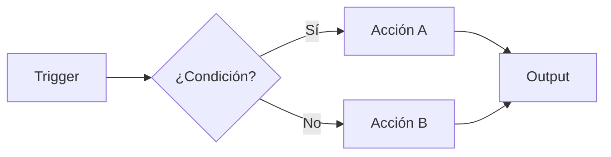
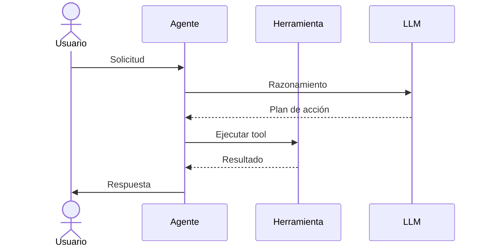
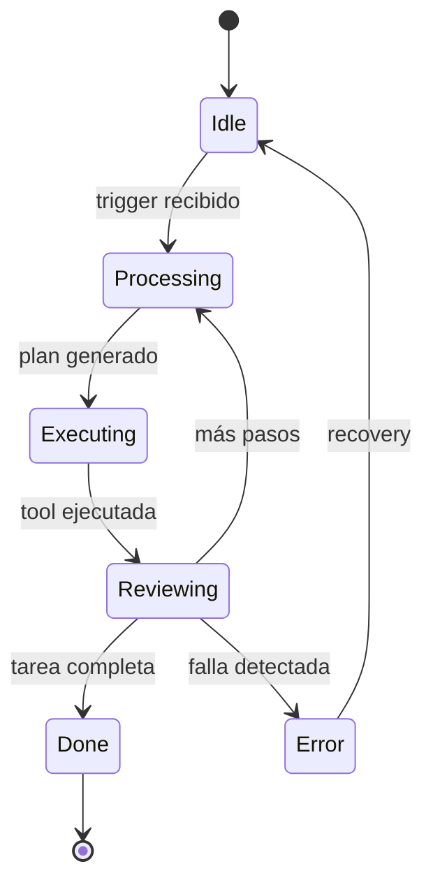
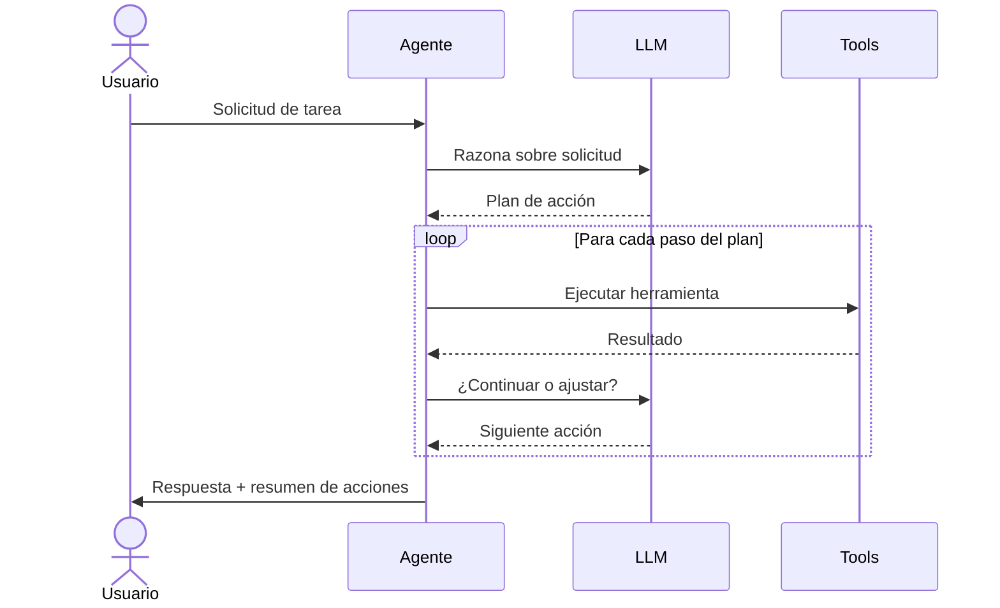
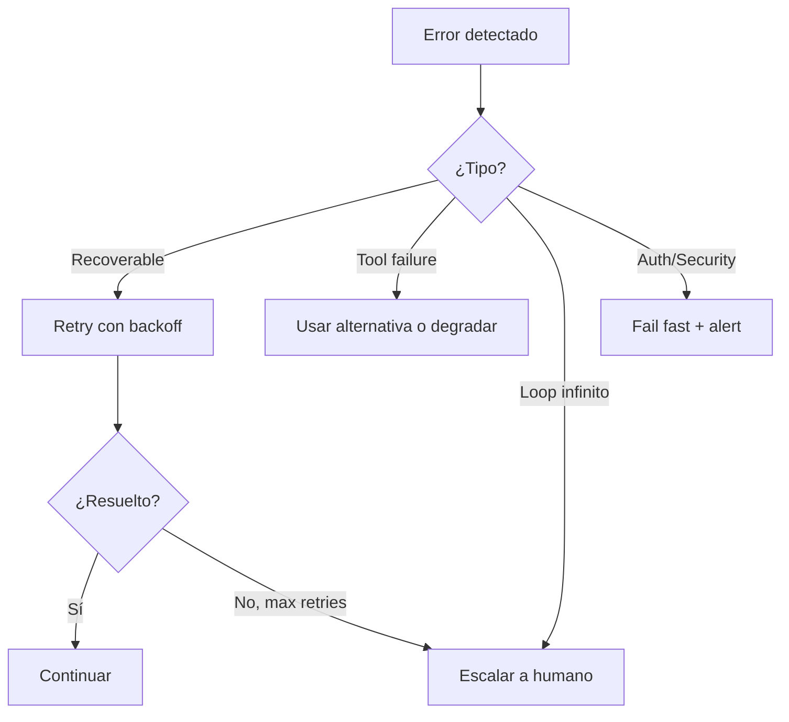

# Mejores Prácticas para Documentos de Versión de Software

**Fecha:** 2026-02-27
**Alcance:** Documentación de versiones, specs de agentes autónomos, versionado semántico, sistemas escalables

---

## Executive Summary

Los documentos de versión efectivos son contratos vivos entre stakeholders, desarrolladores y el propio sistema. Para proyectos de software —y en particular para agentes autónomos de IA— la documentación de una versión específica (v1, v2, etc.) debe cumplir tres funciones simultáneas: comunicar el alcance con precisión, servir de guía ejecutable para el equipo de desarrollo, y fijar una línea base desde la cual evolucionar.

La investigación identifica que los documentos más efectivos combinan una estructura PRD (Product Requirements Document) con secciones propias de system design: arquitectura técnica, contratos de interfaz, manejo de errores, y observabilidad. Para agentes de IA autónomos, se agrega una capa de comportamiento esperado —qué puede decidir el agente por sí mismo, qué requiere confirmación humana, y cuáles son sus límites de acción.

El principio fundamental de separación de versiones es: **v1 define lo que se construye ahora y por qué; las versiones futuras aparecen solo como referencias explícitas en una sección de "Fuera de Alcance" o "Roadmap"**. Esta separación evita scope creep y mantiene al equipo enfocado.

---

## Introducción

Documentar una versión de software no es simplemente escribir qué hace el sistema. Es establecer:

1. **Por qué existe esta versión** — el problema que resuelve en este momento
2. **Qué incluye exactamente** — funcionalidades con límites claros
3. **Qué queda fuera** — igual de importante que lo que está adentro
4. **Cómo se comporta** — flujos, errores, casos borde
5. **Cómo crecerá** — puntos de extensión pensados desde el diseño

Para sistemas de agentes autónomos, la documentación adquiere una dimensión adicional: el agente mismo puede consumir partes de su spec como contexto operativo. Esto hace que la claridad y estructura del documento tenga impacto directo en el comportamiento del sistema.

---

## Metodología

Esta investigación consultó las siguientes fuentes:

- Guías de PRD de Perforce, Atlassian, Product School, y Aha!
- Análisis de GitHub sobre 2,500+ archivos agents.md
- Guías de arquitectura de agentes de Google Cloud, Microsoft Azure, y OneReach.ai
- Documentación de Semantic Versioning (semver.org)
- Estándares de observabilidad de OpenTelemetry para agentes de IA
- Guías de Mermaid.js para diagramas en markdown
- Estudios sobre Non-Functional Requirements de Perforce y Altexsoft

---

## Hallazgos Principales

### 1. Estructura de Documentos de Versión / Release (PRD Moderno)

#### El PRD como Documento Vivo

La tendencia moderna (2025-2026) trata el PRD no como un documento estático sino como un artefacto vivo que evoluciona con el producto. Las mejores prácticas establecen que debe ser:

- **Orientado al problema, no a la solución**: Cada requerimiento debe conectar explícitamente con un pain point del usuario
- **Conciso y ejecutable**: Evitar especificaciones exhaustivas que no se puedan implementar
- **Con jerarquía clara**: Themes > Epics > Features > User Stories

#### Jerarquía Estándar de Requerimientos

```
Nivel 1 - Theme: Objetivo estratégico de largo plazo
  Nivel 2 - Epic: Proyecto grande que contribuye al Theme
    Nivel 3 - Feature: Funcionalidad específica con valor para el usuario
      Nivel 4 - User Story: "Como [persona], quiero [acción] para [beneficio]"
        Nivel 5 - Acceptance Criteria: Condiciones verificables de completitud
```

#### Secciones Canónicas de un PRD Moderno

| Sección | Propósito | Obligatoria |
|---------|-----------|-------------|
| Título y metadatos | Identificación, autor, fecha, versión del doc | Sí |
| Change History | Historial de cambios al documento mismo | Sí |
| Executive Summary | Qué es, por qué existe, qué problema resuelve | Sí |
| Goals & Success Metrics | OKRs, KPIs medibles, definición de éxito | Sí |
| User Personas | Usuarios objetivo con necesidades y pain points | Sí |
| Scope / In-Scope | Lista explícita de qué se incluye | Sí |
| Out of Scope | Lista explícita de qué NO se incluye | Sí |
| Functional Requirements | Features con historias de usuario y criterios | Sí |
| Non-Functional Requirements | Performance, seguridad, escalabilidad | Sí |
| Technical Design | Arquitectura, componentes, flujos | Recomendada |
| Error Handling | Casos de falla y comportamiento esperado | Recomendada |
| Dependencies | Sistemas externos, APIs, servicios | Recomendada |
| Timeline | Hitos y fechas de release | Opcional |
| Open Questions | Preguntas sin responder, riesgos | Recomendada |
| Future Considerations | Roadmap breve de versiones futuras | Recomendada |

---

### 2. Documentación de Agentes Autónomos de IA

#### Qué Hace Especial a la Documentación de Agentes

Los agentes autónomos tienen características que los diferencian de software tradicional:

1. **Toman decisiones en tiempo real** — el spec debe definir los límites de esa autonomía
2. **Consumen su propio spec como contexto** — la claridad del documento afecta el comportamiento
3. **Tienen bucles de razonamiento no deterministas** — requieren documentar comportamientos esperados, no solo algoritmos
4. **Interactúan con herramientas externas** — cada tool necesita documentación de contrato
5. **Pueden fallar de formas inesperadas** — el error handling debe ser un ciudadano de primera clase

#### Secciones Críticas para Agentes de IA

**A. Definición del Agente**

```markdown
## Agent Identity
- **Nombre**: [Nombre del agente]
- **Versión**: 1.0.0
- **Tipo**: [ReAct / Plan-and-Execute / Multi-agent Orchestrator / etc.]
- **Dominio**: [El área en la que opera]
- **Objetivo primario**: [Una sola oración que describe su propósito]
- **Owners**: [Equipo responsable]
```

**B. Alcance de Autonomía (critical para agentes)**

Esta sección define qué puede hacer el agente sin supervisión humana vs. qué requiere aprobación:

```markdown
## Autonomy Scope

### Puede hacer sin aprobación:
- [Acción 1]
- [Acción 2]

### Requiere confirmación humana:
- [Acción de alto impacto 1]
- [Acción irreversible 1]

### Nunca debe hacer:
- [Restricción absoluta 1]
- [Restricción absoluta 2]
```

**C. Arquitectura del Agente**

Los componentes estándar documentados por Google Cloud y Microsoft incluyen:



**D. Catálogo de Herramientas (Tool Catalog)**

Cada herramienta que usa el agente debe documentarse como un contrato:

```markdown
### Tool: [nombre_herramienta]
- **Propósito**: Qué hace esta herramienta
- **Input**: Schema de entrada (preferiblemente OpenAPI/JSON Schema)
- **Output**: Schema de salida
- **Errores posibles**: Lista de errores y cómo los maneja el agente
- **Rate limits / restricciones**: Límites de uso
- **Cuando usarla**: Criterios de selección
- **Cuando NO usarla**: Casos en los que el agente debe evitarla
```

**E. Flujos de Datos**

Documentar cómo fluye la información a través del sistema:

- Flujo happy path (operación normal)
- Flujos de error y recuperación
- Flujos de escalación humana

**F. Manejo de Errores**

Microsoft Azure y Datagrid identifican cinco categorías de error en agentes:

| Tipo de Error | Descripción | Estrategia |
|---------------|-------------|------------|
| Tool timeout | La herramienta no responde | Retry con backoff exponencial |
| Auth failure | Credenciales inválidas o expiradas | Fail fast + notificación |
| Rate limit | Límite de API alcanzado | Queue + retry after |
| Schema mismatch | Output inesperado de herramienta | Fallback + log |
| Reasoning loop | El agente se queda en bucle | Max iterations + human escalation |
| Cascading failure | Error en cadena multi-agente | Circuit breaker pattern |

**G. Observabilidad**

OpenTelemetry establece tres pilares para agentes:

```markdown
### Metrics (cuantitativo)
- Latencia por step del agente
- Tasa de éxito/error por herramienta
- Número de iteraciones por tarea
- Tokens consumidos por sesión

### Traces (causalidad)
- Trace completo de una sesión de agente
- Span por cada tool call
- Contexto de decisión en cada paso

### Logs (auditabilidad)
- Cada acción tomada + rationale
- Identificador de usuario/sesión
- Timestamp + secuencia de acciones
- Estado antes y después de cada acción
```

---

### 3. Mejores Prácticas para Documentos MD de Especificación

#### Estructura Jerárquica de Headings

```markdown
# Título del Documento (H1) — solo uno por documento
## Sección Principal (H2) — 5-10 secciones
### Subsección (H3) — detalles de cada sección
#### Elemento específico (H4) — solo cuando sea necesario
```

#### Diagramas con Mermaid

GitHub renderiza automáticamente bloques Mermaid en markdown. Los tipos más útiles para specs de sistemas:

**Flowchart (flujos de proceso):**
```

```

**Sequence Diagram (interacciones entre componentes):**
```

```

**State Diagram (estados del agente):**
```

```

#### Tablas de Decisión

Las tablas de decisión son más legibles que los if-else anidados en prosa:

```markdown
| Condición A | Condición B | Condición C | Acción |
|-------------|-------------|-------------|--------|
| Verdadero   | Verdadero   | -           | Acción 1 |
| Verdadero   | Falso       | Verdadero   | Acción 2 |
| Verdadero   | Falso       | Falso       | Acción 3 |
| Falso       | -           | -           | Acción 4 |
```

#### Nivel de Detalle Recomendado

- **Demasiado vago**: "El agente procesará solicitudes del usuario" — no ejecutable
- **Demasiado detallado**: Pseudocódigo completo de cada función — se vuelve código, no spec
- **Nivel correcto**: Comportamiento observable + criterios de aceptación + contratos de interfaz

La regla práctica: el spec debe ser lo suficientemente detallado para que un desarrollador nuevo pueda implementarlo sin preguntar nada fundamental, pero no tan detallado que dicte el "cómo" de cada decisión de implementación.

---

### 4. Versionado Semántico y Roadmaps

#### Semver Aplicado a Proyectos de Agentes

El estándar Semantic Versioning 2.0.0 (semver.org) define:

```
MAJOR.MINOR.PATCH
  1.0.0 → Primera versión estable
  1.1.0 → Nueva funcionalidad backwards-compatible
  1.1.1 → Bug fix
  2.0.0 → Breaking change (cambia contratos de interfaz)
```

Para proyectos de agentes, se aplica así:

| Tipo de cambio | Versión | Ejemplo |
|----------------|---------|---------|
| Nuevo agente o capabilities radicalmente diferentes | MAJOR | v1 → v2 |
| Nueva herramienta o flujo adicional | MINOR | v1.0 → v1.1 |
| Fix de comportamiento o prompt | PATCH | v1.0.0 → v1.0.1 |
| Cambio de contrato de API del agente | MAJOR | v1 → v2 |

#### Cómo Separar v1 de Versiones Futuras

**Principio clave**: El documento de v1 NO debe describir v2 en detalle. Las versiones futuras aparecen exclusivamente en:

1. Una sección "Out of Scope" — menciona lo que explícitamente queda fuera de v1
2. Una sección "Future Considerations" — lista breve sin specs detalladas
3. Comentarios de diseño que explican por qué ciertas decisiones de arquitectura permiten extensión

**Ejemplo de separación correcta:**

```markdown
## Out of Scope — v1

Las siguientes capacidades están explícitamente fuera del alcance de esta versión:

- **Multi-agent orchestration**: v1 es un agente único. La arquitectura multi-agente
  está considerada para v2 pero no se diseña ni implementa aquí.
- **Persistencia de memoria a largo plazo**: v1 opera con contexto de sesión.
  Una base de conocimiento persistente es un feature de versiones futuras.
- **Integración con [Sistema X]**: Evaluada para v1.2 pendiente de feedback.

## Future Considerations (no comprometidas)

| Versión | Capacidad | Dependencia |
|---------|-----------|-------------|
| v1.1 | Soporte para herramienta X | Feedback de v1.0 |
| v2.0 | Arquitectura multi-agente | Estabilidad de v1 |
| v2.0 | Memoria persistente | Evaluación de costos |
```

#### Estructura de Roadmap en el Documento

El roadmap dentro de un documento de versión debe ser conservador y honesto:

```markdown
## Release Plan

### v1.0.0 — [Fecha target]
Alcance: [Lo que este documento especifica]
Criterio de exit: [Tests pasan + revisión de seguridad + aprobación de stakeholder]

### v1.1.0 — [Fecha tentativa o "TBD"]
Alcance tentativo: [Features post-v1 identificadas]
Trigger: [Condición que activa el desarrollo de v1.1]

### v2.0.0 — [No comprometida]
Dirección: [Visión de alto nivel, sin specs]
```

---

### 5. Documentación de Sistemas Escalables

#### Puntos de Extensión

Un sistema diseñado para crecer debe documentar explícitamente dónde puede ser extendido sin romper el core:

```markdown
## Extension Points

### Point 1: Tool Registry
**Descripción**: El agente descubre herramientas a través de un registro.
**Cómo extender**: Implementar la interfaz `ITool` y registrar en el catálogo.
**Contrato**:
- Input: `ToolRequest` (schema definido)
- Output: `ToolResponse` (schema definido)
- Error: `ToolError` con códigos estándar

### Point 2: Memory Backend
**Descripción**: La memoria del agente es un adaptador intercambiable.
**Cómo extender**: Implementar `IMemoryStore`.
**Implementaciones incluidas en v1**: In-memory (default)
**Implementaciones planeadas**: Redis, Vector DB
```

#### Contratos de Interfaz

Los contratos deben ser explícitos y versionados:

```markdown
## Interface Contracts

### AgentInput v1
```json
{
  "session_id": "string (UUID)",
  "user_message": "string",
  "context": {
    "user_id": "string",
    "metadata": "object (optional)"
  }
}
```

### AgentOutput v1
```json
{
  "session_id": "string (UUID)",
  "response": "string",
  "actions_taken": ["string"],
  "status": "completed | partial | failed",
  "error": "object (nullable)"
}
```

**Política de versionado de contratos**: Los cambios breaking en estos schemas
incrementan MAJOR version. Los cambios aditivos incrementan MINOR.
```

#### Documentar Decisiones de Diseño (ADRs)

Los Architecture Decision Records son una práctica consolidada para sistemas escalables:

```markdown
## Architecture Decision Records

### ADR-001: [Título de la decisión]
**Fecha**: [fecha]
**Estado**: Accepted / Superseded / Deprecated

**Contexto**: Por qué esta decisión fue necesaria.

**Decisión**: Qué se decidió hacer.

**Consecuencias**:
- Positivas: [beneficios]
- Negativas: [trade-offs aceptados]
- Puntos de extensión habilitados: [qué permite esta decisión en el futuro]
```

---

## Análisis: Estructura Recomendada para un Documento v1 de Agente Autónomo

Combinando todos los hallazgos, la estructura óptima para el documento de versión 1 de un agente autónomo es la siguiente:

### Plantilla Completa: Version Document v1 — Agente Autónomo

```
# [Nombre del Agente] — Version 1.0
> Spec v[X] | Última actualización: [fecha] | Estado: [Draft/Review/Approved]

---

## 1. Metadata del Documento
- Autor(es)
- Reviewers
- Historial de cambios (tabla)
- Estado del documento

## 2. Executive Summary
(3-5 párrafos: qué es, problema que resuelve, solución propuesta, métricas de éxito)

## 3. Contexto y Motivación
- Problema a resolver
- Por qué un agente autónomo (vs alternativas)
- Contexto del negocio / proyecto

## 4. Objetivos y Métricas de Éxito
- Goals (cualitativos)
- Success metrics (cuantitativos, medibles)
- Definición de "Done" para v1

## 5. Usuarios y Stakeholders
- User personas
- Stakeholders del proyecto
- Casos de uso primarios

## 6. Alcance de v1
### 6.1 In-Scope
(Lista explícita de funcionalidades incluidas)

### 6.2 Out of Scope
(Lista explícita de qué NO está en v1 — igual de importante)

## 7. Arquitectura del Sistema
### 7.1 Visión General (diagrama Mermaid)
### 7.2 Componentes Principales
### 7.3 Flujo de Datos (diagrama de secuencia)
### 7.4 Stack Tecnológico

## 8. Comportamiento del Agente
### 8.1 Alcance de Autonomía
  - Puede hacer sin aprobación
  - Requiere confirmación humana
  - Nunca debe hacer
### 8.2 Flujo Principal (Happy Path)
### 8.3 Flujos de Error
### 8.4 Casos Borde Documentados

## 9. Catálogo de Herramientas (Tool Catalog)
(Una subsección por cada tool con contrato completo)

## 10. Requerimientos No Funcionales
- Performance (latencias esperadas, throughput)
- Seguridad (auth, data protection, prompt filtering)
- Escalabilidad (límites de v1, puntos de crecimiento)
- Confiabilidad (uptime target, recovery time)
- Observabilidad (logs, metrics, traces)

## 11. Contratos de Interfaz
- Input schema (versionado)
- Output schema (versionado)
- Error schema
- Política de versionado de contratos

## 12. Puntos de Extensión
(Dónde y cómo el sistema puede crecer sin romper v1)

## 13. Manejo de Errores
(Tabla de errores, estrategias, escalación)

## 14. Seguridad y Privacidad
- Modelo de amenazas
- Controles implementados en v1
- Data handling

## 15. Decisiones de Arquitectura (ADRs)
(Una subsección por decisión importante)

## 16. Dependencias y Riesgos
- Dependencias externas
- Riesgos identificados y mitigaciones

## 17. Plan de Release
- Criterios de exit de v1
- Proceso de deployment
- Rollback plan

## 18. Future Considerations
(Roadmap tentativo sin specs detalladas)

## 19. Glosario
(Términos técnicos y del dominio)

## 20. Referencias
```

---

## Ejemplo Concreto: Fragment de Documento v1

El siguiente fragmento demuestra cómo se vería una sección real del documento:

```markdown
# PIPA Agent — Version 1.0
> Spec v0.3 | Última actualización: 2026-02-27 | Estado: Draft

---

## 6. Alcance de v1

### 6.1 In-Scope

Las siguientes capacidades están incluidas en v1.0:

- **[Capacidad A]**: Descripción específica de qué hace y bajo qué condiciones
- **[Capacidad B]**: Descripción con límites claros (ej. "máximo N operaciones por sesión")
- **[Capacidad C]**: Con nota de criterio de aceptación

### 6.2 Out of Scope — v1

> Estas exclusiones son explícitas y deliberadas. Mencionarlas previene
> expectativas incorrectas y scope creep durante el desarrollo.

- **Multi-sesión con memoria persistente**: v1 opera en sesiones independientes.
  La persistencia de contexto entre sesiones se evalúa para v1.2.
- **Integración con [Sistema Externo X]**: Depende de disponibilidad de API.
  Considerada para v1.1 post-estabilización.
- **Capacidad avanzada Y**: Requiere datos de operación de v1 para ser diseñada
  correctamente. Planificada para v2.0.

---

## 8. Comportamiento del Agente

### 8.1 Alcance de Autonomía

| Acción | Autonomía | Justificación |
|--------|-----------|---------------|
| Leer datos de [fuente] | Sin aprobación | Solo lectura, sin riesgo |
| Generar [artefacto] | Sin aprobación | Reversible, bajo impacto |
| Enviar [notificación] | Confirmación | Acción visible para usuarios |
| Modificar [recurso crítico] | Aprobación explícita | Irreversible |
| Eliminar cualquier dato | Nunca en v1 | Riesgo inaceptable |

### 8.2 Flujo Principal



### 8.3 Manejo de Errores


```

---

## Conclusiones

### Patrones que Distinguen Documentos Efectivos

1. **La sección "Out of Scope" es tan importante como "In-Scope"**: Los mejores documentos de versión son precisamente precisos sobre qué *no* hacen. Esto es especialmente crítico en agentes de IA donde las expectativas tienden a inflarse.

2. **Los contratos de interfaz deben ser schemas versionados**: No descripciones en prosa. Un campo JSON versionado explícitamente vale más que tres párrafos descriptivos.

3. **El alcance de autonomía del agente es una sección de primer nivel**: No es un detalle técnico. Es una decisión de diseño con implicaciones de seguridad, UX y responsabilidad legal.

4. **Los diagramas Mermaid reemplazan texto descriptivo**: Un diagrama de secuencia de 15 líneas comunica más que 300 palabras describiendo el mismo flujo.

5. **Las ADRs (Architecture Decision Records) previenen deuda técnica de documentación**: Documentar por qué se tomó cada decisión importante permite que el equipo futuro entienda los trade-offs en lugar de deshacer trabajo por falta de contexto.

6. **La observabilidad se documenta antes de implementarse**: Definir qué se va a medir (metrics, traces, logs) en el spec fuerza al equipo a pensar en operabilidad desde el diseño.

---

## Recomendaciones Accionables

### Para un Documento v1 de Agente Autónomo

1. **Empieza con el "Alcance de Autonomía"** antes que con la arquitectura técnica. Es la decisión más importante y afecta todo lo demás.

2. **Usa la plantilla de 20 secciones** como checklist, no como obligación. Omite secciones que genuinamente no aplican, pero sé explícito sobre por qué las omites.

3. **Versiona el documento mismo** (no solo el software). El spec v0.1 es el borrador inicial, v0.9 es pre-aprobación, v1.0 es el baseline para desarrollo.

4. **Define los contratos de interfaz en JSON Schema** desde el primer día. Es más trabajo inicial pero ahorra semanas de ambigüedad durante implementación.

5. **Incluye exactamente 2-4 diagramas Mermaid**: Uno de arquitectura general, uno de flujo principal (sequence), uno de flujo de errores, y opcionalmente uno de estados del agente.

6. **La sección de Future Considerations debe ser intencionalmente vaga**: Nombres de capacidades sin specs. Si tienes specs detalladas de v2, crea un documento separado de v2 — no lo pongas en el de v1.

7. **Pide a alguien que no conoce el proyecto que lea el spec antes de usarlo**: Si tiene preguntas fundamentales sobre qué hace o no hace el sistema, el spec necesita más trabajo.

8. **Guarda el SPEC.md en el repositorio** y vincúlalo como contexto para el agente. Addy Osmani y la comunidad de agentes convergen en que el spec persistente en el repo es la mejor práctica para anchoring entre sesiones.

---

## Referencias

- [How to Write a PRD: Complete Guide — Perforce](https://www.perforce.com/blog/alm/how-write-product-requirements-document-prd)
- [The Only PRD Template You Need — Product School](https://productschool.com/blog/product-strategy/product-template-requirements-document-prd)
- [What is a PRD? — Atlassian](https://www.atlassian.com/agile/product-management/requirements)
- [PRD Document Template in 2025 — Kuse.ai](https://www.kuse.ai/blog/insight/prd-document-template-in-2025-how-to-write-effective-product-requirements)
- [AI Agent Architecture: Best Practices — Patronus AI](https://www.patronus.ai/ai-agent-development/ai-agent-architecture)
- [Choose your agentic AI architecture components — Google Cloud](https://docs.cloud.google.com/architecture/choose-agentic-ai-architecture-components)
- [Best Practices for AI Agent Implementations 2026 — OneReach.ai](https://onereach.ai/blog/best-practices-for-ai-agent-implementations/)
- [How to Write a Good Spec for AI Agents — Addy Osmani](https://addyosmani.com/blog/good-spec/)
- [How to Write a Good Spec for AI Agents — O'Reilly](https://www.oreilly.com/radar/how-to-write-a-good-spec-for-ai-agents/)
- [How to Write a Great agents.md — GitHub Blog](https://github.blog/ai-and-ml/github-copilot/how-to-write-a-great-agents-md-lessons-from-over-2500-repositories/)
- [Agentic AI Architecture: Production-Ready Guide — Medium/AgenticAI](https://medium.com/agenticai-the-autonomous-intelligence/agentic-ai-architecture-a-practical-production-ready-guide-2b2aa6d16118)
- [Agent Observability — OpenTelemetry Blog](https://opentelemetry.io/blog/2025/ai-agent-observability/)
- [Agent Observability Best Practices — Microsoft Azure](https://azure.microsoft.com/en-us/blog/agent-factory-top-5-agent-observability-best-practices-for-reliable-ai/)
- [Exception Handling for AI Agent Failures — Datagrid](https://datagrid.com/blog/exception-handling-frameworks-ai-agents)
- [Semantic Versioning 2.0.0 — semver.org](https://semver.org/)
- [Mermaid Diagrams in Markdown — GitHub Blog](https://github.blog/developer-skills/github/include-diagrams-markdown-files-mermaid/)
- [Non-Functional Requirements — Perforce](https://www.perforce.com/blog/alm/what-are-non-functional-requirements-examples)
- [How to Write a Software Requirements Specification — Perforce](https://www.perforce.com/blog/alm/how-write-software-requirements-specification-srs-document)
- [Release Notes Template Guide — The Good Docs Project](https://www.thegooddocsproject.dev/template/release-notes)
